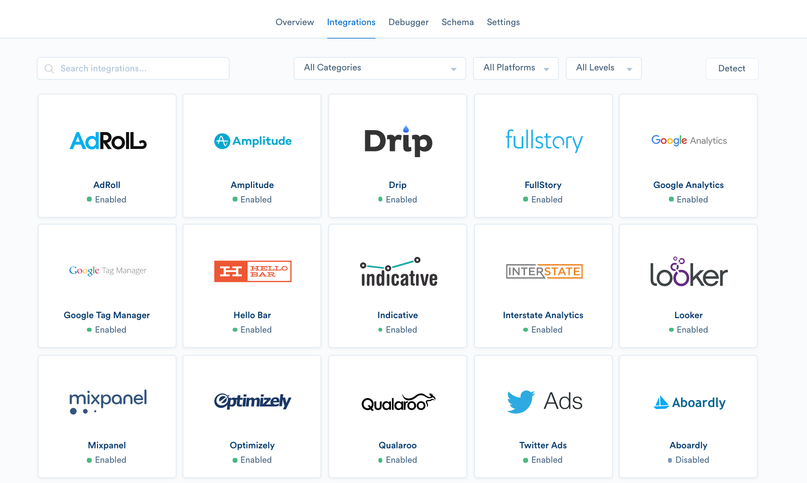

+++
date = "2016-10-25T00:00:00Z"
title = "Segment Integrations"
featureslug = "integrations"
type = "breakdown"
feature = "integrations"
company = "segment"
+++

Segment is an enterprise SaaS solution that helps companies simplify their analytics. In 2011, the founders came across an engineering pain of writing redundant tracking code to send customer behavioral events to Google Analytics, MixPanel, and KISSmetrics. A few months later, [analytics.js](https://github.com/segmentio/analytics.js), an analytics wrapper library, was conceived.

It became evident the value of having the same, consistent customer data across all the tools that rely on them. Now, Segment supports over [200 different marketing and analytics tools](https://segment.com/integrations/?utm_campaign=enterprise-ready-2016&utm_medium=content-text&utm_source=enterprise-ready), as well as data warehousing services such as [Redshift](https://segment.com/warehouses/redshift/?utm_campaign=enterprise-ready-2016&utm_medium=content-text&utm_source=enterprise-ready) and [BigQuery](https://segment.com/warehouses/bigquery/?utm_campaign=enterprise-ready-2016&utm_medium=content-text&utm_source=enterprise-ready).

In an effort to capture the entire customer journey, Segment launched [Sources](https://segment.com/sources/?utm_campaign=enterprise-ready-2016&utm_medium=content-text&utm_source=enterprise-ready), which pulls data from third-party cloud apps, such as Zendesk, Stripe, and Salesforce, into your data warehouse. This allows their customers to query and create custom reports across the customer journey—talking to your support team, clicking on a Facebook display ad,  reading your blog—which provides a rich and detailed analysis of your users.

The Segment team understands the value that each additional integration provides their customers and have a [pricing plan](https://segment.com/pricing/?utm_campaign=enterprise-ready-2016&utm_medium=content-text&utm_source=enterprise-ready) that reflects that philosophy. Although the downstream integrations are unlimited, pricing differs based on the number of Sources enabled.

